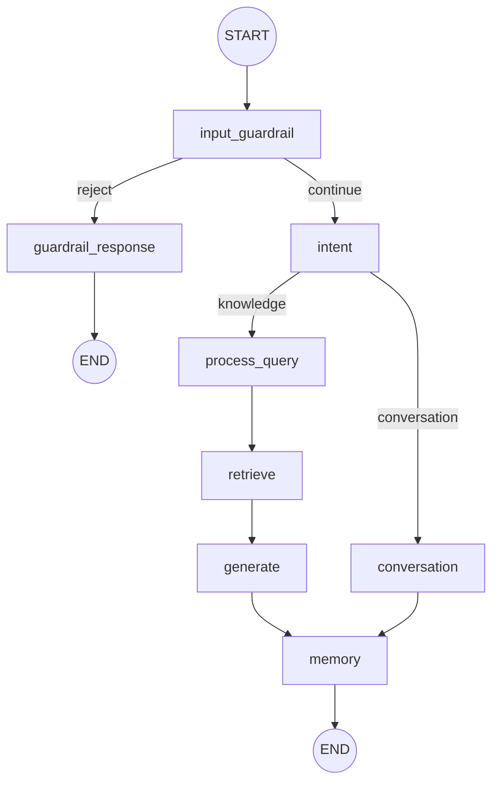
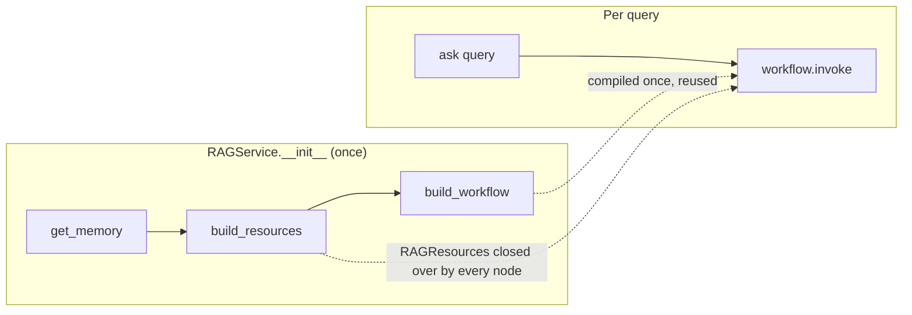
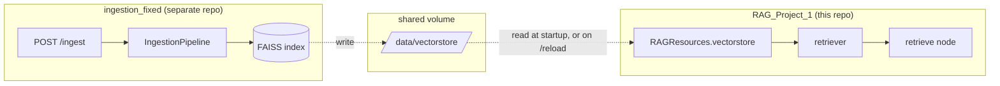

# 01 — Architecture

> For a full module-by-module reference, see [`DOCUMENTATION.md`](../DOCUMENTATION.md)
> at the repo root. This page is the shorter, diagram-first version.

## What this service does

A LangGraph-orchestrated RAG chatbot: validate the input, detect intent,
route knowledge questions through retrieval + generation, route
greetings/chit-chat straight to the LLM, and keep conversation memory.
It does **not** build the vector index it reads from — that's the sibling
[`ingestion_fixed`](../../ingestion_fixed/DOCUMENTATION.md) project's job.
See `07-design-decisions.md` for why that split exists.

## Workflow graph

See [`assets/workflow.svg`](assets/workflow.svg) for the rendered version.
Mermaid source (renders directly on GitHub):

## Node responsibilities

| Node | File | Responsibility |
|---|---|---|
| `input_guardrail` | `nodes/input_guardrail.py` | Run the 5-validator guardrail chain |
| `guardrail_response` | `nodes/guardrail_response.py` | Build rejection answer, short-circuit to END |
| `intent` | `nodes/intent.py` | LLM classification → `knowledge` / `greeting` / `chit_chat` |
| `process_query` | `nodes/process_query.py` | Pronoun-aware query rewrite (knowledge branch only) |
| `retrieve` | `nodes/retrieve_context.py` | FAISS similarity search, build context string |
| `generate` | `nodes/generate_knowledge.py` | Grounded answer from context |
| `conversation` | `nodes/generate_conversation.py` | Greeting/chit-chat answer, no retrieval |
| `memory` | `nodes/update_memory.py` | Append turn to conversation history |

## Shared resources, not rebuilt per request

`RAGResources` (`resources.py`) holds `llm`, `embeddings`, `vectorstore`,
`retriever`, `memory` — built once in `RAGService.__init__`, then closed
over by every node's lambda in `workflow.py`. This is also what makes
`RAGService.reload_index()` work: it's a plain mutable dataclass, so
swapping `resources.vectorstore`/`resources.retriever` in place is visible
to the already-compiled graph without rebuilding it. See §12 of
`DOCUMENTATION.md` for the API that exposes this.

## Where the vector index actually comes from

This is the part worth being deliberate about: `src/retrieval/vectorstore.py`
only ever *loads* an index — there's no build path left in this repo (see
§8 of `DOCUMENTATION.md` for the full history of ingestion code that used to
live here and was removed). If you're debugging "retrieval returns nothing
useful," check which index `FAISS_INDEX_PATH` actually points at before
assuming the workflow logic is wrong.

## What's explicitly out of scope right now

- Reranking, hybrid/BM25 search, metadata filtering (README Phase 2/3) —
  `retriever.py` is plain top-k similarity search, `k=3`.
- Per-session conversation memory — one shared history per process today.
- Source citations, streaming responses, auth (README Phase 4).

See `05-roadmap.md`.
